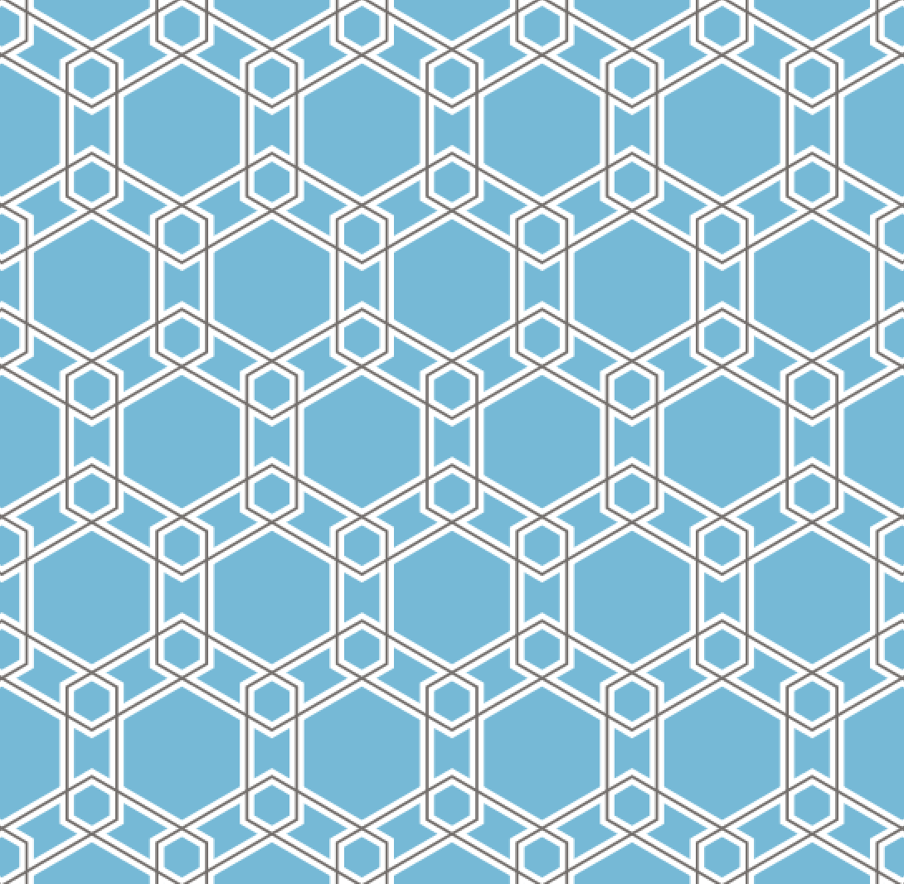

## Patterns

Sometimes it's fun to make patterns and to use Python for this.

* ```Hexagons.pyde```: recreating a pattern from [this article](https://www.theguardian.com/science/alexs-adventures-in-numberland/2015/feb/10/muslim-rule-and-compass-the-magic-of-islamic-geometric-design)

<a href="https://www.theguardian.com/science/alexs-adventures-in-numberland/2015/feb/10/muslim-rule-and-compass-the-magic-of-islamic-geometric-design">
    
</a>

## References

* [Adventures in Numberland](https://www.theguardian.com/science/alexs-adventures-in-numberland)
* [Engare](http://www.engare.design/)
* Marrakech

## Installation

* Download and install Processing from http://www.processing.org.
* Install Processing's Python Mode.
